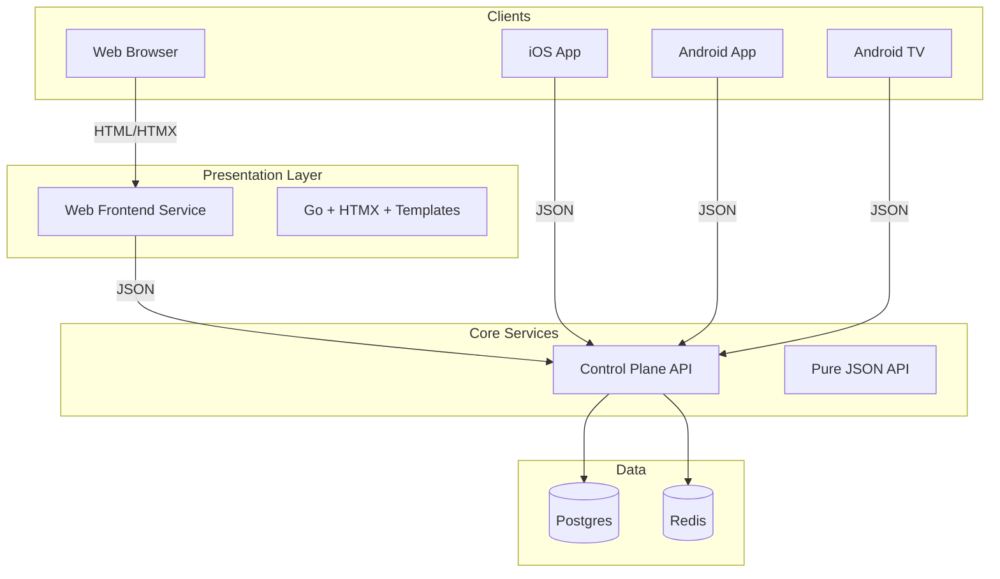

# Architecture Proposal: Decoupling Web Frontend from Control Plane

## 1. Executive Summary
Currently, the `ControlPlane` service acts as a monolith for the frontend, serving both the API logic and the HTML/HTMX UI. To support a multi-client ecosystem (iOS, Android, TV, Web) where all clients consume a unified API, we will extract the Web UI into a dedicated service.

This change transforms the **Control Plane** into a pure "Headless" API and creates a new **Web Frontend** service that acts as a client, similar to the mobile apps.

## 2. High-Level Architecture

## 3. Component Responsibilities

### 3.1. Control Plane (Refactored)
*   **Role**: The Source of Truth. Pure API.
*   **Responsibilities**:
    *   Authentication & Authorization (JWT issuance/validation).
    *   Media Metadata Management (CRUD).
    *   Playback Orchestration (Transcoding decisions).
    *   User State (Watch history, favorites).
*   **Changes Required**:
    *   **Remove**: All `html/template` rendering logic.
    *   **Remove**: Static file serving (`/static`, `.css`, `.js`).
    *   **Refactor**: Ensure all endpoints return strict JSON.
    *   **Add**: CORS configuration to allow requests from the Web Frontend (if running on different domains/ports).

### 3.2. Web Frontend Service (New)
*   **Role**: The "Browser" Client.
*   **Technology**: Go (Standard Lib) + HTMX + Tailwind CSS (per `AGENTS.md`).
*   **Responsibilities**:
    *   **Server-Side Rendering (SSR)**: Serves the initial `index.html` shell.
    *   **Backend-for-Frontend (BFF)**:
        *   Receives HTMX requests (e.g., `GET /partials/library`).
        *   Calls Control Plane API (e.g., `GET http://control-plane/api/library`).
        *   Renders the JSON response into HTML fragments using Go Templates.
        *   Returns HTML to the browser.
    *   **Static Assets**: Serves CSS, JS, Images.
    *   **Proxying**: May need to proxy stream URLs if they are internal, or expose them directly if the Control Plane returns public URLs.

## 4. API Contract Strategy

The Control Plane will expose a RESTful JSON API.

| Feature | Method | Endpoint | Request Body | Response |
| :--- | :--- | :--- | :--- | :--- |
| **List Media** | `GET` | `/api/v1/media` | - | `[ { "id": "...", "title": "..." } ]` |
| **Get Media** | `GET` | `/api/v1/media/{id}` | - | `{ "id": "...", "metadata": {...} }` |
| **Playback** | `POST` | `/api/v1/playback` | `{ "mediaId": "...", "capabilities": {...} }` | `{ "streamUrl": "...", "type": "hls" }` |
| **Auth** | `POST` | `/api/v1/auth/login` | `{ "user": "...", "pass": "..." }` | `{ "token": "..." }` |

## 5. Migration Plan

### Phase 1: Setup New Service
1.  Create `src/WebFrontend`.
2.  Move `src/ControlPlane/templates` to `src/WebFrontend/templates`.
3.  Move static assets (if any) to `src/WebFrontend/static`.

### Phase 2: Refactor Control Plane
1.  Modify `src/ControlPlane/main.go` to remove UI routes (`/`, `/library`, etc.).
2.  Ensure `/api/*` endpoints are robust and cover all data needs of the UI.

### Phase 3: Implement Web Frontend Logic
1.  Implement Go handlers in `WebFrontend` to fetch data from `ControlPlane`.
2.  Update templates to render data passed from the new handlers (which originated from the API).

### Phase 4: Integration
1.  Update `docker-compose` or Kubernetes manifests to run both services.
2.  Configure `WebFrontend` with the `CONTROL_PLANE_URL` environment variable.

## 6. Benefits
*   **Consistency**: Mobile apps and Web app consume the exact same data and logic.
*   **Scalability**: The UI layer can scale independently of the API/Business logic.
*   **Development**: Frontend developers can work on the Web Service without touching the Core API (mocking the API responses).